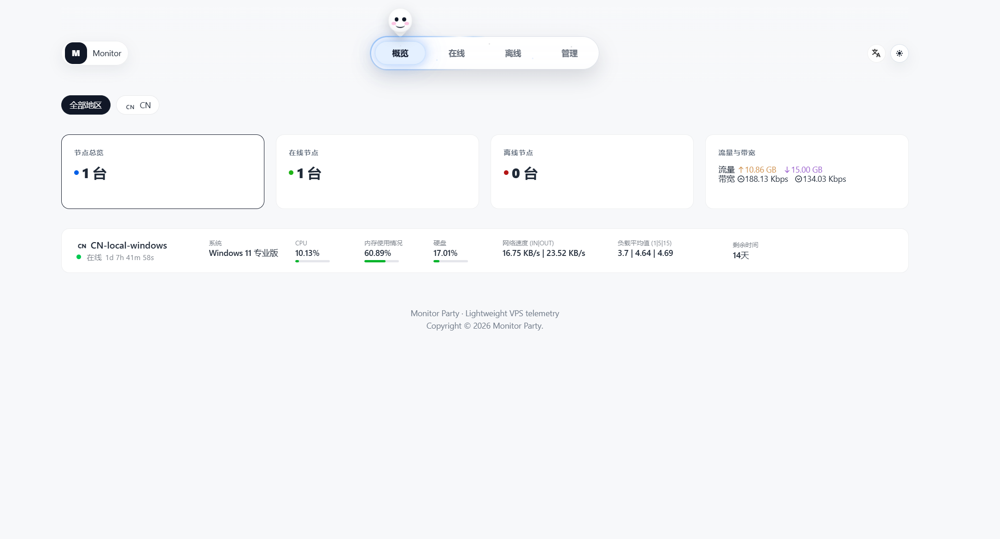

<div align="center">

# 云镜监控 / Yunjing Monitor

**轻量级 VPS / 服务器监控面板 ｜ Lightweight VPS / Server Monitoring Panel**

由中心端 `vps-server` 与采集端 `vps-agent` 组成：实时采集 CPU、内存、硬盘、网络、负载、连接数与在线状态，提供公开监控面板、管理后台、节点管理、Agent 安装命令生成、Agent 二进制下载与 WebSocket 实时推送。

A lightweight monitoring system composed of a central `vps-server` and per-node `vps-agent` collectors. It captures CPU / memory / disk / network / load / connections / online status in real time, and ships a public panel, an admin console, node management, one-click agent install commands, embedded agent binary downloads, and a live WebSocket feed.

---

🇨🇳 中文 ｜ 🇬🇧 English（双语文档 / bilingual document）

</div>

---

## 目录 / Table of Contents

- [简介 / Overview](#简介--overview)
- [特性 / Features](#特性--features)
- [架构 / Architecture](#架构--architecture)
- [演示截图 / Screenshots](#演示截图--screenshots)
- [快速开始 / Quick Start](#快速开始--quick-start)
- [一键安装 / One-click Install](#一键安装--one-click-install)
- [添加 Agent 节点 / Add an Agent Node](#添加-agent-节点--add-an-agent-node)
- [配置文件 / Configuration](#配置文件--configuration)
- [数据文件与流量统计 / Data & Traffic Accounting](#数据文件与流量统计--data--traffic-accounting)
- [本地开发 / Local Development](#本地开发--local-development)
- [构建 / Build](#构建--build)
- [技术栈 / Tech Stack](#技术栈--tech-stack)
- [运维 / Operations](#运维--operations)
- [安全建议 / Security Notes](#安全建议--security-notes)
- [常见问题 / FAQ](#常见问题--faq)
- [参与贡献 / Contributing](#参与贡献--contributing)
- [License](#license)

---

## 简介 / Overview

**中文**

云镜监控是一个轻量级 VPS / 服务器监控面板，由中心端 `vps-server` 和采集端 `vps-agent` 组成。中心端提供公开监控面板、管理员后台、节点管理、Agent 安装命令生成、Agent 二进制下载和 WebSocket 数据推送；Agent 负责采集并上报 CPU、内存、硬盘、网络、负载、连接数和在线状态。

默认示例域名：`https://monitor.example.com`

**English**

Yunjing Monitor is a lightweight VPS / server monitoring panel built from two binaries:

- **`vps-server`** (central): public monitoring panel, admin console, node management, agent-install-command generator, embedded agent binary download, and a live WebSocket push service.
- **`vps-agent`** (collector): reads local config, samples system metrics on a schedule, and reports to the center using a per-node token.

Default example domain: `https://monitor.example.com`

> ℹ️ **来源说明 / Provenance**：本项目参考了 Akile Monitor、哪吒监控等同类产品的监控信息架构与交互思路；当前代码、视觉组件与品牌资产由云镜监控项目独立维护，且不是这些项目的官方发行版。
> Yunjing Monitor takes product-level inspiration from monitoring dashboards such as Akile Monitor and Nezha Monitor. Its current code, visual components, and brand assets are independently maintained and it is not an official distribution of either project.

---

## 特性 / Features

- **一体化中心端 / All-in-one central server**：公开面板、管理后台、API、WebSocket、Agent 下载均由 `vps-server` 提供，单个二进制配合一个持久化数据目录即可上线。
- **多平台 Agent / Multi-platform agent**：Linux `amd64 / arm64 / armv7 / 386`，Windows `amd64 / arm64 / 386`。
- **实时监控 / Real-time telemetry**：CPU、内存、Swap、硬盘、网络速率、累计流量、负载、运行时间和在线状态。前台展开节点详情可查看系统、内核、CPU 型号、物理/逻辑核心、磁盘读写速率、进程数、TCP/UDP、运行时长与数据更新时间。
- **节点管理 / Node management**：预创建节点（`pending` 占位）、生成安装命令、删除节点、编辑套餐/购买信息、一键导出/导入节点备份 JSON。
- **节点级 token / Per-node tokens**：每个节点独立 Agent token；鉴权使用 SHA-256 哈希，后台回看副本使用 `AUTH_SECRET` 派生密钥进行 AES-GCM 加密，不保存明文。
- **可插拔存储 / Pluggable storage**：默认 JSON 文件存储；可选 SQLite（`STORE_DRIVER=sqlite`，pure-Go `modernc.org/sqlite`，无 CGO）。首次启用时会一次性从旧 `server.json` 自动导入。
- **每节点周期流量 / Per-node cycle traffic**：默认每月 1 号重置，后台可设 1-31 号；小月无对应日期自动按当月最后一天重置；计数器重置/回滚时只更新基准值，不扣减本周期流量；统计由中心端持久化，节点或中心端重启后继续累计。
- **安全加固 / Hardened by default**：拒绝默认弱密钥、限制 Node ID 字符集、收紧配置文件权限、Agent 默认要求 HTTPS（仅 `localhost` / `127.0.0.1` 允许 HTTP）。
- **无第三方 WebSocket 库 / Hand-rolled WebSocket**：中心端 WebSocket 为手写实现，零额外运行时依赖。
- **数据安全 / Data safety**：加密全量备份、逐文件 SHA-256、SQLite 一致性快照、恢复预演、恢复前回滚包、定时备份与可选 WebDAV 异地同步。
- **运维中心 / Operations center**：节点健康、资产成本、市场运营、备份状态、资源/离线/到期告警、Telegram/Webhook 通知和更新历史。
- **可靠市场 / Reliable marketplace**：上架与 Owner 编辑原子提交，节点和上架支持回收站恢复，关键操作写入审计日志。
- **历史趋势 / Historical metrics**：按分钟降采样保留 7 天，前台支持实时、1h、6h、24h、7d 趋势。
- **平台自动化 / Platform automation**：节点分组与标签、保存视图、维护窗口、公开状态页、Agent 灰度升级、API Key、OpenAPI 和 HMAC Webhook。
- **统一用户账号 / Unified user accounts**：用户可自助注册并管理自己名下的私有或公开监控节点、Agent 安装命令、到期日期和市场上架，无需管理员逐台创建。
- **服务可用性监控 / Service monitoring**：支持 HTTP、HTTPS、TCP、Ping 和 SSL，提供状态码与响应关键字校验、连续失败与持续时间策略、恢复通知、IP/证书变化和证书到期提醒。
- **多地区探测 / Regional probes**：将现有 Agent 绑定为远程探测点，每 30 秒拉取任务并最多四路并发执行；中心端统一汇总 24 小时可用率、平均延迟和各地区结果。
- **可组织的监控概览 / Organized overview**：空数据首次接入引导、节点筛选与排序、列表/卡片/地区分布视图和账号偏好保存，兼顾桌面与移动端。
- **流量额度 / Traffic quotas**：按节点设置周期流量额度和告警阈值，展示当前用量、下次重置时间，并在超限及恢复时生成事件与通知。
- **市场信任 / Marketplace trust**：卖家信任档案、举报处理、需求订阅与统一币种价格分析。
- **可安装前端 / Installable frontend**：公开面板提供 PWA manifest 和离线应用壳，可安装到桌面或手机；实时数据恢复联网后继续读取。

---

## 架构 / Architecture

```text
                 ┌────────────────── 中心端 vps-server ──────────────────┐
                 │  公开面板 /        管理后台 /admin       API            │
                 │  WebSocket /ws     Agent 下载 /download/*   安装脚本 /install/*  │
                 └───────────────────────────┬──────────────────────────────┘
                                              │ HTTPS  +  Bearer token  +  X-Node-ID
            POST /api/agent/report (Metrics) │   GET /api/agent/ping
                                              ▼
        ┌────────────── 采集端 vps-agent ─────────────┐
        │  config.env → 定时采集 → 速率差分 → 上报       │
        │  子命令: run | once | test | version         │
        │  Windows Service / systemd / console 三模式   │
        └──────────────────────────────────────────────┘
                              ▲
                              │ fetch /config.json → WebSocket /ws + REST /api/*
            公开前端 SPA (Vue3 + Vite + Arco + Highcharts，编译入 web/dist)
```

**数据流 / Data flow**

1. Agent 按 `BasicInterval`（默认 2s）单 ticker 触发一次采集；磁盘用量、连接数分别按 `DiskInterval`(30s)、`ConnectionInterval`(60s) 子采样以摊销开销。CPU%、网络速率、磁盘 IO 速率由相邻两次计数器差分得到。
2. Agent 通过 `POST /api/agent/report` 上报 `Metrics`，请求头携带 `X-Node-ID` 与 `Authorization: Bearer <token>`，单一尝试、无重试/无队列。
3. 中心端校验 token 哈希（`SHA-256(base64url)`）后 `UpsertReport` 落库，并 `MarkDirty()` 使下一次公开读取重建快照。
4. 公开前端通过 `/config.json` 获取 WebSocket 地址，连接 `/ws` 后由中心端推送 `AkileHosts` 快照（共享同一份缓存序列化字节，至多每秒重建一次）。

**鉴权模型 / Auth model**

- **Agent**：`X-Node-ID` + `Authorization: Bearer` → token 哈希比对（常量时间比较）。
- **Admin**：`/api/admin/login` 用常量时间比较校验账密 → 签发持久化 `monitor_admin` 会话 cookie；勾选“保持登录”后最长 30 天。所有变更类 POST 校验 `Origin`（CSRF 防护），会话文件使用 `AUTH_SECRET` 保护。

---

## 演示截图 / Screenshots

<p align="center">
  
</p>

> 截图文件位于仓库根目录 `preview.png`。
> The screenshot lives at the repository root as `preview.png`.

---

## 快速开始 / Quick Start

> 发布包将由 `ithtelab/yunjing-monitor` 的 GitHub Release 提供。在首个公开 Release 发布前，这些下载地址不会生效。

**中文** —— 需要修改的只有两个地方：`https://你的域名` 和 `你的后台密码`。

中心端一键安装（Linux amd64）：

```bash
curl -fsSL https://github.com/ithtelab/yunjing-monitor/releases/latest/download/install-server-linux.sh | sudo sh -s -- \
  --bin-url "https://github.com/ithtelab/yunjing-monitor/releases/latest/download/vps-server-linux-amd64"
```

安装器会首次生成独立的 `BACKUP_ENCRYPTION_KEY`，升级时自动沿用现有值。迁移已有备份密钥时可额外传入 `--backup-encryption-key "你的独立备份密钥"`；请将该密钥离线保存，丢失后旧备份不可解密。

带参数一次性安装，避免交互：

```bash
curl -fsSL https://github.com/ithtelab/yunjing-monitor/releases/latest/download/install-server-linux.sh | sudo sh -s -- \
  --public-url "https://你的域名" \
  --admin-user "admin" \
  --admin-pass "你的后台密码" \
  --auth-secret "换成一串随机密钥" \
  --bin-url "https://github.com/ithtelab/yunjing-monitor/releases/latest/download/vps-server-linux-amd64"
```

查看状态 / 日志：

```bash
sudo systemctl status vps-server
sudo journalctl -u vps-server -f
```

**English** — you only need to set two values: `https://your-domain` and your admin password.

One-click install (Linux amd64):

```bash
curl -fsSL https://github.com/ithtelab/yunjing-monitor/releases/latest/download/install-server-linux.sh | sudo sh -s -- \
  --bin-url "https://github.com/ithtelab/yunjing-monitor/releases/latest/download/vps-server-linux-amd64"
```

Non-interactive install:

```bash
curl -fsSL https://github.com/ithtelab/yunjing-monitor/releases/latest/download/install-server-linux.sh | sudo sh -s -- \
  --public-url "https://monitor.example.com" \
  --admin-user "admin" \
  --admin-pass "your-admin-password" \
  --auth-secret "a-strong-random-secret" \
  --bin-url "https://github.com/ithtelab/yunjing-monitor/releases/latest/download/vps-server-linux-amd64"
```

The installer generates an independent `BACKUP_ENCRYPTION_KEY` on first install and preserves it during upgrades. Pass `--backup-encryption-key "your-existing-backup-key"` only when migrating an existing key, and keep it in offline storage because old backups cannot be decrypted without it.

```bash
sudo systemctl status vps-server
sudo journalctl -u vps-server -f
```

完成后访问 / After install, open:

```text
https://your-domain/admin
```

安装脚本会询问 / The installer prompts:

```text
Public URL [https://monitor.example.com]
Internal secret (leave empty to generate)
Admin username [admin]
Admin password (leave empty to generate)
Listen address [:3000]
Max nodes [2000]
Binary download URL (empty for local file)
```

说明 / Notes：

- `Public URL`：公网访问地址，**生产环境必须 HTTPS**。
- `Internal secret`：中心端内部安全密钥，**不是**后台登录密码，留空自动生成。
- `Admin password`：后台登录密码，与 `Internal secret` **不需要一致**，留空自动生成。
- 中心端不再需要填写全局 `Agent token`——每个节点的 token 会在后台单独签发。

---

## 一键安装 / One-click Install

### Linux

```bash
# amd64
curl -fsSL https://github.com/ithtelab/yunjing-monitor/releases/latest/download/install-server-linux.sh | sudo sh -s -- \
  --bin-url "https://github.com/ithtelab/yunjing-monitor/releases/latest/download/vps-server-linux-amd64"

# arm64
#   --bin-url "https://github.com/ithtelab/yunjing-monitor/releases/latest/download/vps-server-linux-arm64"
# armv7
#   --bin-url "https://github.com/ithtelab/yunjing-monitor/releases/latest/download/vps-server-linux-armv7"
# 386
#   --bin-url "https://github.com/ithtelab/yunjing-monitor/releases/latest/download/vps-server-linux-386"
```

### Windows（中心端 / central server）

```powershell
$arch = if ($env:PROCESSOR_ARCHITECTURE -eq "ARM64") { "arm64" } elseif ($env:PROCESSOR_ARCHITECTURE -eq "x86" -and -not $env:PROCESSOR_ARCHITEW6432) { "386" } else { "amd64" }
$installDir = "C:\Program Files\vps-monitor"
$dataDir = "C:\ProgramData\vps-monitor"
New-Item -ItemType Directory -Force -Path $installDir,$dataDir | Out-Null
Invoke-WebRequest "https://github.com/ithtelab/yunjing-monitor/releases/latest/download/vps-server-windows-$arch.exe" -OutFile "$installDir\vps-server.exe" -UseBasicParsing
$env:ADDR = ":3000"
$env:PUBLIC_URL = "https://你的域名"
$env:AUTH_SECRET = [guid]::NewGuid().ToString("N") + [guid]::NewGuid().ToString("N")
$env:ADMIN_USER = "admin"
$env:ADMIN_PASS = "你的后台密码"
$env:DATA_PATH = "$dataDir\server.json"
& "$installDir\vps-server.exe"
```

开机自启（计划任务 / scheduled task）：

```powershell
$arch = if ($env:PROCESSOR_ARCHITECTURE -eq "ARM64") { "arm64" } elseif ($env:PROCESSOR_ARCHITECTURE -eq "x86" -and -not $env:PROCESSOR_ARCHITEW6432) { "386" } else { "amd64" }; $installDir = "C:\Program Files\vps-monitor"; $dataDir = "C:\ProgramData\vps-monitor"; New-Item -ItemType Directory -Force -Path $installDir,$dataDir | Out-Null; Invoke-WebRequest "https://github.com/ithtelab/yunjing-monitor/releases/latest/download/vps-server-windows-$arch.exe" -OutFile "$installDir\vps-server.exe" -UseBasicParsing; $secret = [guid]::NewGuid().ToString("N") + [guid]::NewGuid().ToString("N"); $run = "@`r`n`$env:ADDR=':3000'`r`n`$env:PUBLIC_URL='https://你的域名'`r`n`$env:AUTH_SECRET='$secret'`r`n`$env:ADMIN_USER='admin'`r`n`$env:ADMIN_PASS='你的后台密码'`r`n`$env:DATA_PATH='$dataDir\server.json'`r`n& '$installDir\vps-server.exe'`r`n"; Set-Content -Path "$installDir\run-server.ps1" -Value $run -Encoding UTF8; schtasks /Create /TN "vps-server" /TR "powershell.exe -ExecutionPolicy Bypass -File `"$installDir\run-server.ps1`"" /SC ONSTART /RL HIGHEST /F; schtasks /Run /TN "vps-server"
```

### Nginx 反向代理 / Reverse proxy

生产环境建议 HTTPS 反代到本机 `3000`：

```nginx
server {
    listen 80;
    server_name monitor.example.com;
    return 301 https://$host$request_uri;
}

server {
    listen 443 ssl http2;
    server_name monitor.example.com;

    ssl_certificate /etc/letsencrypt/live/monitor.example.com/fullchain.pem;
    ssl_certificate_key /etc/letsencrypt/live/monitor.example.com/privkey.pem;

    location / {
        proxy_pass http://127.0.0.1:3000;
        proxy_set_header Host $host;
        proxy_set_header X-Real-IP $remote_addr;
        proxy_set_header X-Forwarded-For $proxy_add_x_forwarded_for;
        proxy_set_header X-Forwarded-Proto $scheme;
    }

    location /ws {
        proxy_pass http://127.0.0.1:3000;
        proxy_http_version 1.1;
        proxy_set_header Upgrade $http_upgrade;
        proxy_set_header Connection "upgrade";
        proxy_set_header Host $host;
        proxy_set_header X-Real-IP $remote_addr;
        proxy_set_header X-Forwarded-For $proxy_add_x_forwarded_for;
        proxy_set_header X-Forwarded-Proto $scheme;
    }
}
```

---

## 添加 Agent 节点 / Add an Agent Node

推荐只通过后台生成安装命令 / Recommended: generate install commands from the admin console.

1. 打开 `https://你的域名/admin`，用安装时设置的管理员账密登录。
2. 在「添加节点」输入 Node ID，例如 `US-node-001`。
3. 点击「添加并生成」。
4. 复制后台生成的 Linux 或 Windows 安装命令到目标服务器执行。

首次生成命令会为节点签发独立 token；再次查看命令不会轮换，只有明确点击“重置 token”才会使旧 Agent 凭据失效。服务端用 SHA-256 哈希完成鉴权，并另存 AES-GCM 加密副本供管理员回看，不保存明文 token。

Node ID 规则 / Node ID rules：

```text
支持中文、英文、数字和常见分隔符
长度 1-96
不能包含换行、引号、斜杠、反斜杠、Shell 控制符或 HTML 尖括号
```

建议命名 / Examples:

```text
US-node-001
JP-node-001
HK-node-001
DE-node-001
CN-上海-腾讯云
```

### Linux Agent

```bash
curl -fsSL https://monitor.example.com/install/agent-linux.sh | sudo sh -s -- \
  --server https://monitor.example.com \
  --token NODE_TOKEN \
  --node-id US-node-001
```

安装后创建 / Installs:

```text
/usr/local/bin/vps-agent
/etc/vps-agent/config.env
/etc/systemd/system/vps-agent.service
```

常用命令 / Commands:

```bash
sudo systemctl status vps-agent
sudo systemctl restart vps-agent
sudo journalctl -u vps-agent -f
```

卸载 / Uninstall:

```bash
curl -fsSL https://monitor.example.com/uninstall/agent-linux.sh | sudo sh
```

### Windows Agent

管理员 PowerShell 中执行 / Run in an elevated PowerShell:

```powershell
powershell -ExecutionPolicy Bypass -Command "iwr https://monitor.example.com/install/agent-windows.ps1 -UseBasicParsing | iex; Install-VpsAgent -Server 'https://monitor.example.com' -Token 'NODE_TOKEN' -NodeId 'US-win-001'"
```

安装后创建 / Installs:

```text
C:\Program Files\vps-agent\vps-agent.exe
C:\ProgramData\vps-agent\config.env
Windows 服务 / Service: vps-agent
```

常用命令 / Commands:

```powershell
Get-Service vps-agent
Restart-Service vps-agent
Stop-Service vps-agent
Start-Service vps-agent
```

卸载 / Uninstall:

```powershell
powershell -ExecutionPolicy Bypass -Command "iwr https://monitor.example.com/uninstall/agent-windows.ps1 -UseBasicParsing | iex"
```

---

## 配置文件 / Configuration

### 中心端 / Central server

```text
/etc/vps-monitor/server.env
```

```env
ADDR=:3000
AUTH_SECRET=replace-with-strong-random-secret
ADMIN_USER=admin
ADMIN_PASS=replace-with-strong-random-password
PUBLIC_URL=https://monitor.example.com
# 默认 false：公开监控隐藏主机名、内核、CPU/GPU 型号和文件系统挂载信息
PUBLIC_MONITOR_DETAILS=false
DATA_PATH=/var/lib/vps-monitor/server.json
MAX_NODES=2000
# 可选:后台和 API 被其他前端域名访问时配置,留空则仅允许同源
CORS_ORIGINS=https://panel.example.com,https://admin.example.com
# 启用后台完整备份；请与 AUTH_SECRET 使用不同的随机密钥
BACKUP_ENCRYPTION_KEY=replace-with-an-independent-random-key-at-least-32-chars
BACKUP_DIR=/var/lib/vps-monitor/backups
# 0 关闭定时备份；也可填 24h、168h
BACKUP_INTERVAL=24h
# 可选 HTTPS WebDAV 异地备份目录
BACKUP_WEBDAV_URL=
BACKUP_WEBDAV_USER=
BACKUP_WEBDAV_PASSWORD=
```

- `PUBLIC_MONITOR_DETAILS=false` 不影响 CPU、内存、磁盘总量、网络速率等公开监控指标，也不影响管理后台和市场内部计算。
- 只有确认需要向所有访客展示完整主机指纹和分区挂载点时，才将 `PUBLIC_MONITOR_DETAILS` 设为 `true`。

启用 SQLite / Enable SQLite:

```env
STORE_DRIVER=sqlite
DB_PATH=/var/lib/vps-monitor/server.db
```

- `DB_PATH` 必须是数据库文件路径，**不要**填目录或站点根目录。
- 首次使用 SQLite 且库为空时，会从 `DATA_PATH` 指向的旧 `server.json` 自动导入节点、套餐、站点设置、token 哈希与流量统计。
- Docker / 1Panel 推荐从仓库的 `.env.example` 创建 Compose 环境变量；不要提交填写真实密钥后的 `.env`。

### Agent

```text
Linux:   /etc/vps-agent/config.env
Windows: C:\ProgramData\vps-agent\config.env
```

```env
SERVER=https://monitor.example.com
TOKEN=node-specific-token
NODE_ID=US-node-001
BASIC_INTERVAL=2s
DISK_INTERVAL=30s
CONNECTION_INTERVAL=60s
MOUNTS=auto
NETWORK_EXCLUDE=lo,docker*,veth*,br-*
DISK_EXCLUDE_FS=tmpfs,devtmpfs,overlay,squashfs,proc,sysfs,cgroup,cgroup2
```

- 配置文件兼容带 BOM 的 `config.env`（避免 Windows PowerShell 5.1 写入 BOM 后解析失败），并按 UTF-8 无 BOM 写入。
- 关键值简写：`BASIC_INTERVAL=5` 等价于 `5s`。
- 非未知键会被拒绝（解析失败即报错）。

修改后重启 / After changes, restart:

```bash
sudo systemctl restart vps-server
```

---

## 数据文件与流量统计 / Data & Traffic Accounting

中心端默认数据目录包含以下持久化内容 / The central data directory contains:

```text
/var/lib/vps-monitor/server.json
/var/lib/vps-monitor/server.db                # SQLite 可选
/var/lib/vps-monitor/content.json             # 公告与旧版自定义日志
/var/lib/vps-monitor/custom-release-notes.json
/var/lib/vps-monitor/metrics-history.json
/var/lib/vps-monitor/alerts.json
/var/lib/vps-monitor/platform-features.json
/var/lib/vps-monitor/visitor-stats.json
/var/lib/vps-monitor/auth-sessions.json
/var/lib/vps-monitor/backups/
/var/lib/vps-monitor/ads/
```

> 仓库内的 `data/server.json` 仅用于本地开发演示，包含示例站点与节点。**生产环境请将 `DATA_PATH` 指向独立数据目录，不要直接复用示例文件。**
> The in-repo `data/server.json` is for local demo only. In production point `DATA_PATH` at an isolated location.

生产环境优先在后台「数据安全」创建并校验加密全量备份。命令行文件副本仅适合停机维护：

```bash
sudo cp /var/lib/vps-monitor/server.json /var/lib/vps-monitor/server.json.bak.$(date +%Y%m%d%H%M%S)
sudo cp /var/lib/vps-monitor/server.db /var/lib/vps-monitor/server.db.bak.$(date +%Y%m%d%H%M%S) 2>/dev/null || true
```

**流量统计语义 / Traffic accounting semantics**

- `累计接收 / 累计发送`：来自节点网卡累计字节，表示总接收/发送；网卡计数器重置后可能归零。
- `本周期接收 / 本周期发送`：由中心端按每次上报的网卡累计值差额计算，并**持久化**到存储；节点或中心端重启后继续累计。
- 默认每月 `1` 号重置本周期流量；可在后台节点编辑里设 `1-31` 号；超过当月天数的日期自动按当月最后一天（例如 31 号在 2 月按 28/29 号）。
- 当节点重启导致网卡累计值变小，中心端判定为计数器重置，只更新基准值，**不扣减**本周期流量。

---

## 本地开发 / Local Development

中心端（JSON 存储）/ Central server (JSON store):

```bash
AUTH_SECRET=replace-with-strong-random-secret \
ADMIN_USER=admin \
ADMIN_PASS=replace-with-strong-random-password \
PUBLIC_URL=http://127.0.0.1:3000 \
DATA_PATH=./data/server.json \
go run ./cmd/vps-server
```

本地 SQLite / Local SQLite:

```bash
AUTH_SECRET=replace-with-strong-random-secret \
ADMIN_USER=admin \
ADMIN_PASS=replace-with-strong-random-password \
PUBLIC_URL=http://127.0.0.1:3000 \
STORE_DRIVER=sqlite \
DB_PATH=./data/server.db \
DATA_PATH=./data/server.json \
go run ./cmd/vps-server
```

Agent：

```bash
SERVER=http://127.0.0.1:3000 \
TOKEN=node-specific-token \
NODE_ID=local-node-001 \
go run ./cmd/vps-agent run --config /path/to/config.env
```

Agent 子命令 / Agent sub-commands: `run`（常驻）、`once`（采一次并打印 JSON）、`test`（ping 中心端验证鉴权）、`version`。

> 说明：Agent 默认要求 HTTPS，只有 `localhost` 和 `127.0.0.1` 允许 HTTP。

前端开发 / Front-end dev:

```bash
cd web
npm install
npm run dev      # 开发,vite --host
```

---

## 构建 / Build

前端 / Front-end:

```bash
cd web
npm install
npm run build
cd ..
```

Release（自动会先构建前端再编译中心端，避免漏嵌前端资源）：

```powershell
powershell -ExecutionPolicy Bypass -File "scripts\build-release.ps1"
```

```bash
sh scripts/build-release.sh   # Linux / macOS
```

产物写入 / Artifacts land in `release/`：

```text
vps-server-linux-{amd64,arm64,armv7,386}
vps-server-windows-{amd64,arm64,386}.exe
vps-agent-linux-{amd64,arm64,armv7,386}
vps-agent-windows-{amd64,arm64,386}.exe
install-server-linux.sh        install-agent-linux.sh        install-agent-windows.ps1
install-updater-linux.sh
uninstall-server-linux.sh      uninstall-agent-linux.sh     uninstall-agent-windows.ps1
```

CI：`go test ./...` + `go vet` + `govulncheck` + 前端 `npm audit` + `npm run build`（见 `.github/workflows/ci.yml`）。Release 资产由 `.github/workflows/release-assets.yml` 构建并上传到 GitHub Release。

---

## 技术栈 / Tech Stack

- **后端 / Back-end**: Go 1.26，纯标准库 + `golang.org/x/sys`（系统信息采集）+ `modernc.org/sqlite`（pure-Go SQLite，无 CGO）。
- **前端 / Front-end**: Vue 3 + Vite + Arco Design Vue + Highcharts + vue-i18n（中/英/日/韩/德）。
- **采集 / Collection**: Linux 走 `/proc` `/sys` `syscall`（零 fork/exec、零 cgo）；Windows 走 `kernel32`/`iphlpapi` syscall + PowerShell(WMI)；其他平台编译桩。
- **存储 / Storage**: JSON 文件（默认）或 SQLite，单一 `application.Store` 接口，两个驱动，编译期断言。

### 目录结构 / Directory layout

```text
cmd/vps-server/                 中心端入口
cmd/vps-agent/                  Agent 入口(run / once / test / version; Windows Service 模式)
internal/server/                中心端逻辑、后台页面、静态资源、内嵌 Agent 二进制、WebSocket、存储层
  internal/server/web/dist/      中心端内嵌前端构建产物
  internal/server/agent_bins/   中心端内嵌 Agent 下载文件
  internal/server/application/  Store 接口与 AkileHost 读模型投影
  internal/server/domain/       持久化类型与流量周期数学
internal/agent/                 Agent 指标采集(跨平台编排 + Linux/Windows/Other 实现)
internal/config/                Agent 配置解析
internal/reporter/              Agent 上报逻辑
scripts/                        构建、安装、卸载脚本源文件
release/                        发布用二进制和安装脚本
web/                            Vue 前端源码
data/                           本地开发数据示例
```

---

## 运维 / Operations

### 健康检查与备份 / Health and backup

- 存活检查：`GET /api/health/live`
- 就绪检查：`GET /api/health/ready`，Docker Compose 健康检查默认使用此接口。
- 后台「数据安全」可创建、校验、下载和恢复预演加密全量备份；执行恢复前程序会再创建 `pre-restore` 回滚包。
- `BACKUP_INTERVAL=24h` 可开启定时备份；配置 `BACKUP_WEBDAV_URL` 后，本地备份成功再同步异地，远端失败不会删除本地包。
- 后台「告警中心」支持 CPU、内存、磁盘、离线和到期告警，以及 Telegram / HTTPS Webhook 通知。

1Panel 部署时，以上变量应放在网站的 Compose 环境变量中；`data` 目录必须作为持久卷保留。升级、迁移或重建容器前先在后台创建备份并点击“校验”。

### 平台扩展 / Platform extensions

后台「扩展能力」集中管理以下能力，数据保存在数据目录的 `platform-features.json`，会自动进入全量备份：

- 为节点设置分组、标签和备注，并保存常用筛选视图。
- 创建按节点或标签生效的维护窗口；启用“暂停告警”后，窗口结束会自动恢复告警评估。
- 创建公开状态页和故障事件，公开地址为 `/status/<slug>`，数据接口为 `GET /api/status/<slug>`。
- 创建 Agent 升级批次，按节点或标签选取目标，通过固定哈希保持灰度节点稳定；Agent 只接受通过节点 token 绑定签名和 SHA-256 校验的清单。
- 创建只显示一次明文的 API Key，密钥在磁盘仅保存 SHA-256；可授权 `nodes:read`、`status:read` 或 `*`，调用时使用 `X-API-Key`。
- 配置 HTTPS Webhook。请求携带 `X-Monitor-Event`、`X-Monitor-Timestamp` 和 `X-Monitor-Signature`，签名内容为 `<timestamp>.<body>` 的 HMAC-SHA256。
- 下载 `/openapi.json` 或后台版本的 `/api/admin/openapi.json`，接入外部只读巡检、资产系统与自动化流程。
- 执行备份校验演练、查看最近信任状态，下载不包含密钥、会话或绝对数据路径的诊断包。

API Key 示例：

```bash
curl -H 'X-API-Key: YOUR_API_KEY' https://example.com/api/v1/nodes
curl -H 'X-API-Key: YOUR_API_KEY' https://example.com/api/v1/status
```

市场 Owner 可在「我的上架」维护需求订阅。新上架或审核通过的服务器匹配地区、标签、最高价格和最低内存条件时，系统记录匹配并通过已配置的事件 Webhook 投递，重复记录不会重复通知。

### 升级中心端 / Upgrade

#### 宝塔 Docker 一键更新

GitHub 仓库为公开仓库时无需 Token；只需在私有仓库时，创建仅限 `ithtelab/yunjing-monitor`、权限为 **Contents: Read-only** 的 Fine-grained Personal Access Token，并写入项目 `.env`：

```dotenv
UPDATE_REPOSITORY=ithtelab/yunjing-monitor
UPDATE_ENABLED=true
# 仅私有仓库需要：
# GITHUB_TOKEN=github_pat_xxx
```

私有仓库的 Token 只保存在服务器，不会通过公开或管理员 API 返回。发布前需在可信电脑生成独立 RSA 发布密钥；私钥只写入 GitHub 仓库的 Actions Secret `RELEASE_SIGNING_KEY`，不得提交到仓库或复制到生产服务器：

```bash
umask 077
openssl genpkey -algorithm RSA -pkeyopt rsa_keygen_bits:3072 -out release-signing-private.pem
openssl pkey -in release-signing-private.pem -pubout -out release-signing.pub
```

将 `release-signing-private.pem` 的完整内容保存为 GitHub Secret，并通过可信通道把 `release-signing.pub` 放到服务器。首次启用时安装更新助手并固定该公钥：

```bash
cd /www/wwwroot/monitor-party
sudo sh scripts/install-updater-linux.sh install \
  --project-dir /www/wwwroot/monitor-party \
  --public-key /root/release-signing.pub
systemctl status monitor-updater.path --no-pager
```

此后后台“系统更新”会检查最新稳定 GitHub Release。管理员再次输入密码后，网站只写入 HMAC 签名请求；无网络端口的 systemd 助手会按宿主机架构下载对应 Linux 二进制、`SHA256SUMS` 和 `SHA256SUMS.sig`，先用本地固定公钥验证发布签名，再验证文件 SHA-256，之后才会备份、重建容器、健康检查及程序回滚。缺少签名、公钥不匹配或架构不匹配都会停止更新。游客只能查看站内更新日志；服务器升级后，仍打开旧页面的访客可点击提示刷新浏览器。

> 更新发布密钥时，必须先通过可信通道在服务器重新安装新公钥，再使用新私钥发布版本。不要从待验证的 GitHub Release 同时下载二进制和公钥。

#### 手动更新

```bash
sudo systemctl stop vps-server
sudo cp /usr/local/bin/vps-server /usr/local/bin/vps-server.bak.$(date +%Y%m%d%H%M%S)
sudo install -m 0755 ./vps-server-linux-amd64 /usr/local/bin/vps-server
sudo systemctl start vps-server
sudo journalctl -u vps-server -n 100 --no-pager
```

> 从旧的全局 `AGENT_TOKEN` 版本升级到节点级 token 版本时，旧 Agent 需在后台重新生成命令并重装，否则无法通过新鉴权。

### 卸载 / Uninstall

中心端 / Central server:

```bash
sudo ./uninstall-server-linux.sh
# 彻底清空(慎用,会清空所有节点/token/站点设置)
sudo rm -rf /etc/vps-monitor /var/lib/vps-monitor
```

Linux Agent:  `sudo ./uninstall-agent-linux.sh`
Windows Agent: `.\uninstall-agent-windows.ps1`

---

## 安全建议 / Security Notes

- `AUTH_SECRET` 和 `ADMIN_PASS` 不需要一致；**不要留空，不要使用 `change-me`**——新版本拒绝空值与默认弱值。
- `BACKUP_ENCRYPTION_KEY` 必须与 `AUTH_SECRET` 独立生成并离线保存；丢失该密钥后已有 `.mpbackup` 无法解密。
- 不要把真实生产环境的 `server.env`、`config.env`、token、密码提交到 GitHub（`.gitignore` 已默认排除 `*.env`、`server.env`、`agent.env`、`docker.env`）。
- 生产环境**必须使用 HTTPS**；Agent 默认强制 HTTPS（仅回环允许 HTTP），token 除回环外绝不明文传输。
- 管理后台建议配合防火墙、Cloudflare Access 或 Nginx Basic Auth 做额外保护。
- 节点安装命令包含该节点**明文 token**，只在可信终端执行，不要公开粘贴。

---

## 常见问题 / FAQ

<details>
<summary><b>中心端启动失败 / Server fails to start</b></summary>

检查 `AUTH_SECRET` 和 `ADMIN_PASS` 是否为空、是否仍是 `change-me`。

```bash
sudo journalctl -u vps-server -n 100 --no-pager
```

</details>

<details>
<summary><b>后台无法登录 / Cannot log in to admin</b></summary>

检查 `/etc/vps-monitor/server.env` 的 `ADMIN_USER` / `ADMIN_PASS`，改后 `sudo systemctl restart vps-server`。主动退出、会话到期或更换 `AUTH_SECRET` 后需要重新登录。

</details>

<details>
<summary><b>Agent 一直离线 / Agent stays offline</b></summary>

- `SERVER` 是否是正确 HTTPS 地址
- `TOKEN` 是否来自后台为该节点生成的安装命令
- `NODE_ID` 是否和后台节点一致
- 中心端防火墙是否放行 443 或 3000
- 反向代理 `/ws` 是否支持 `Upgrade`

```bash
sudo journalctl -u vps-agent -f
sudo journalctl -u vps-server -f
```

</details>

<details>
<summary><b>前台 WebSocket 不刷新 / Panel not updating</b></summary>

确认 Nginx `/ws` 配置包含 `proxy_http_version 1.1`、`Upgrade`、`Connection "upgrade"`（见 上文 Nginx 段）。

</details>

<details>
<summary><b>重新生成节点 token / Regenerate a node token</b></summary>

进入后台，点击节点对应的「命令」，系统会为该节点生成新 token 并更新存储的哈希。旧 token 立即失效，需用新命令重装或更新 Agent 配置。

</details>

---

## 参与贡献 / Contributing

提交问题、功能建议或代码前，请阅读 [CONTRIBUTING.md](CONTRIBUTING.md)、[SECURITY.md](SECURITY.md) 和 [CODE_OF_CONDUCT.md](CODE_OF_CONDUCT.md)。安全漏洞必须通过 GitHub Security Advisory 私下报告。

---

## License

本项目采用 [MIT License](LICENSE)。你可以使用、修改和再分发本项目，但须保留许可证与版权声明。

This project is released under the [MIT License](LICENSE). You may use, modify, and redistribute it while retaining the license and copyright notice.

---

## 致谢 / Acknowledgements

- 感谢 [Akile Monitor](https://github.com/akile-network/akile_monitor_fe) 与 [哪吒监控](https://github.com/nezhahq/nezha) 等开源监控项目带来的产品与社区启发；云镜监控不是这些项目的分支或官方版本。
- 友链 / Friends: [Linux.do](https://linux.do/)
